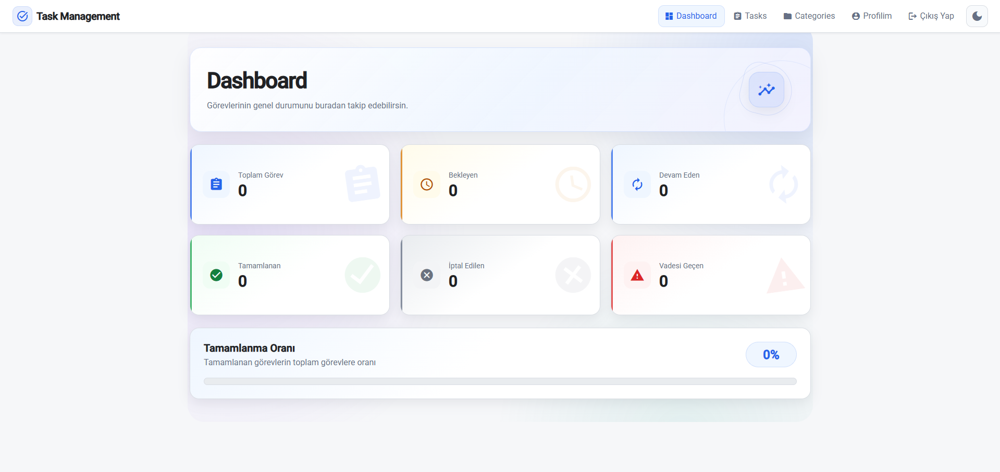
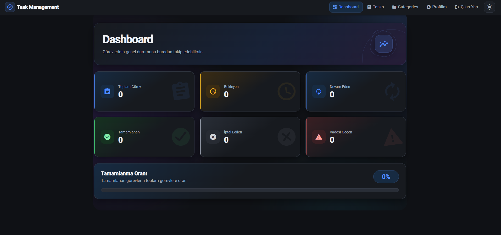
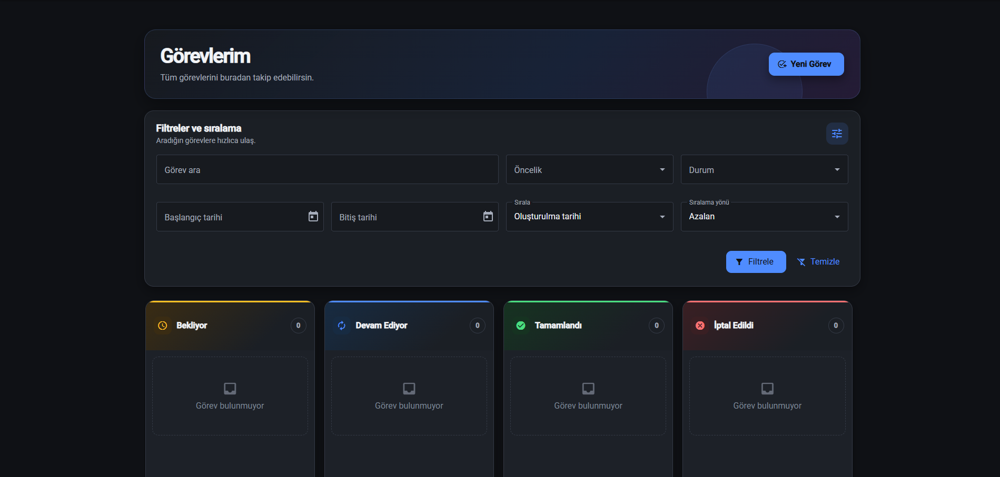
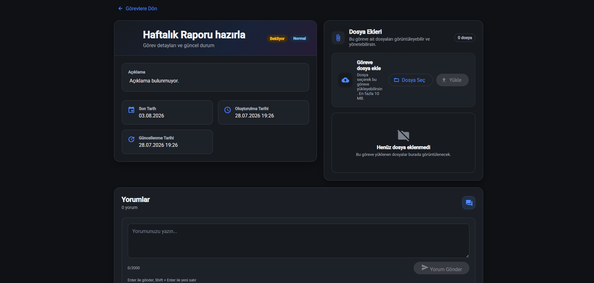
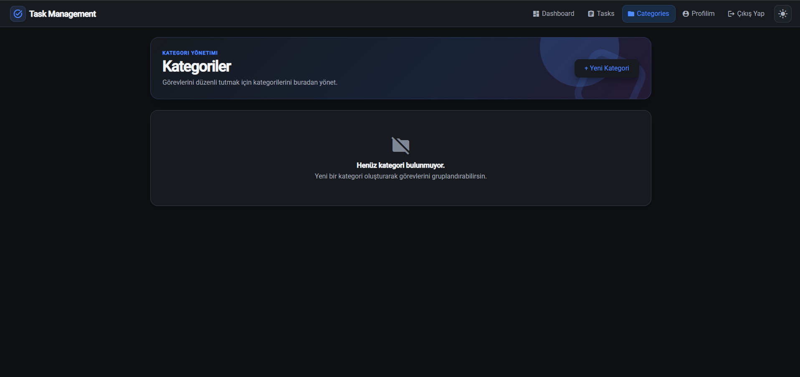
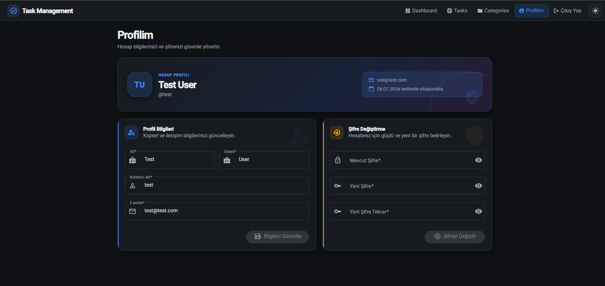

# Task Management System

[](https://dotnet.microsoft.com/)
[](https://angular.dev/)
[](https://learn.microsoft.com/ef/core/)
[](https://www.postgresql.org/)
[](https://www.oracle.com/database/)
[](https://material.angular.dev/)

ASP.NET Core Web API ve Angular ile geliştirilmiş full-stack görev yönetimi uygulaması. JWT authentication, rol bazlı yetkilendirme, Kanban board, Drag & Drop, Dark/Light tema, görev istatistikleri ve provider bazında ayrılmış PostgreSQL/Oracle migration desteği sunar.

## Özellikler

- JWT Authentication
- `User` ve `Admin` rolleriyle authorization
- Kullanıcı bazlı veri izolasyonu
- Görev ve kategori CRUD işlemleri
- Görev yorumları ve dosya ekleri
- Drag & Drop destekli Kanban board
- Arama, filtreleme, sıralama ve pagination
- Dashboard ve görev istatistikleri
- Geciken görev takibi
- Profil ve parola yönetimi
- Admin kullanıcı yönetimi
- Responsive mobil/masaüstü arayüz
- Dark / Light tema
- Serilog logging
- Health Check endpoint’i
- Development ortamında Swagger UI
- PostgreSQL ve Oracle provider desteği

## Teknolojiler

| Katman | Teknolojiler |
| --- | --- |
| Backend | ASP.NET Core Web API, .NET 9, C# |
| Frontend | Angular 21, TypeScript, RxJS, SCSS |
| UI | Angular Material, Angular CDK |
| Veri erişimi | Entity Framework Core 8, AutoMapper |
| Veritabanı | PostgreSQL, Oracle |
| Güvenlik | JWT Bearer, BCrypt, role-based authorization |
| İzleme | Serilog, Health Checks |

## Ekran Görüntüleri

| Dashboard — Light | Dashboard — Dark |
| --- | --- |
|  |  |

| Görevler | Görev Detayı |
| --- | --- |
|  |  |

| Kategoriler | Profil |
| --- | --- |
|  |  |

<!-- Yeni ekran görüntüleri docs/screenshots/ dizinine eklenebilir. -->

## Proje Yapısı

```text
TaskManagementSystem/
├── Backend/
│   ├── TaskManagement.API/                    # ASP.NET Core Web API
│   ├── TaskManagement.Data/                   # DbContext ve ortak veri modeli
│   ├── Migrations.PostgreSql/                 # PostgreSQL migration assembly
│   ├── TaskManagement.API.Migrations.Oracle/  # Oracle migration assembly
│   ├── TaskManagement.SecurityTests/
│   └── TaskManagement.ProviderTests/
├── Frontend/
│   └── TaskManagement.Web/                    # Angular uygulaması
├── docs/screenshots/                          # Proje görselleri
└── deploy.ps1                                 # Backend Release publish scripti
```

## Hızlı Başlangıç

Gereksinimler:

- .NET 9 SDK
- Node.js `^20.19.0`, `^22.12.0` veya `>=24.0.0`
- npm
- PostgreSQL veya Oracle Database
- EF Core CLI 8.x

Bağımlılıkları yükleyin:

```powershell
dotnet restore .\Backend\TaskManagement.API\TaskManagement.API.csproj

Set-Location .\Frontend\TaskManagement.Web
npm ci
Set-Location ..\..
```

Development secret’larını tanımlayın:

```powershell
dotnet user-secrets set "ConnectionStrings:PostgreSql" "<CONNECTION_STRING>" --project .\Backend\TaskManagement.API\TaskManagement.API.csproj
dotnet user-secrets set "Jwt:Key" "<STRONG_RANDOM_SECRET>" --project .\Backend\TaskManagement.API\TaskManagement.API.csproj
dotnet user-secrets set "Jwt:Issuer" "<JWT_ISSUER>" --project .\Backend\TaskManagement.API\TaskManagement.API.csproj
dotnet user-secrets set "Jwt:Audience" "<JWT_AUDIENCE>" --project .\Backend\TaskManagement.API\TaskManagement.API.csproj
```

## Veritabanı ve Migration

`DatabaseProvider` değeri `PostgreSql` veya `Oracle` olarak ayarlanır. Her provider yalnız kendi migration assembly’sini ve `__EFMigrationsHistory` zincirini kullanır.

PostgreSQL:

```powershell
$env:ConnectionStrings__PostgreSql = "<CONNECTION_STRING>"

dotnet ef database update --project .\Backend\Migrations.PostgreSql\TaskManagement.API.Migrations.PostgreSql.csproj --startup-project .\Backend\Migrations.PostgreSql\TaskManagement.API.Migrations.PostgreSql.csproj --connection "$env:ConnectionStrings__PostgreSql"
```

Oracle:

```powershell
$env:ConnectionStrings__Oracle = "<CONNECTION_STRING>"

dotnet ef database update --project .\Backend\TaskManagement.API.Migrations.Oracle\TaskManagement.API.Migrations.Oracle.csproj --startup-project .\Backend\TaskManagement.API.Migrations.Oracle\TaskManagement.API.Migrations.Oracle.csproj --connection "$env:ConnectionStrings__Oracle"
```

Ayrıntılı migration komutları için [`Backend/MIGRATIONS.md`](Backend/MIGRATIONS.md) dosyasına bakın.

## Uygulamayı Çalıştırma

Backend:

```powershell
$env:DatabaseProvider = "PostgreSql"
dotnet run --project .\Backend\TaskManagement.API\TaskManagement.API.csproj --launch-profile http
```

Frontend:

```powershell
Set-Location .\Frontend\TaskManagement.Web
npm start
```

| Servis | Adres |
| --- | --- |
| Angular | `http://localhost:4200` |
| API | `http://localhost:5266` |
| Swagger | `http://localhost:5266/swagger` |
| Health Check | `http://localhost:5266/health` |

## Production Build

Backend publish:

```powershell
.\deploy.ps1
```

Çıktı: `publish/backend/`

Frontend build:

```powershell
Set-Location .\Frontend\TaskManagement.Web
npm run build
```

Çıktı: `Frontend/TaskManagement.Web/dist/TaskManagement.Web/browser/`

## Yapılandırma Dosyaları

- `Backend/TaskManagement.API/appsettings.json`
- `Backend/TaskManagement.API/appsettings.Development.json`
- `Backend/TaskManagement.API/appsettings.Production.json`
- `Frontend/TaskManagement.Web/src/environments/environment.ts`
- `Frontend/TaskManagement.Web/src/environments/environment.prod.ts`

Production API adresi frontend build öncesinde `environment.prod.ts` içinde ayarlanmalıdır.
